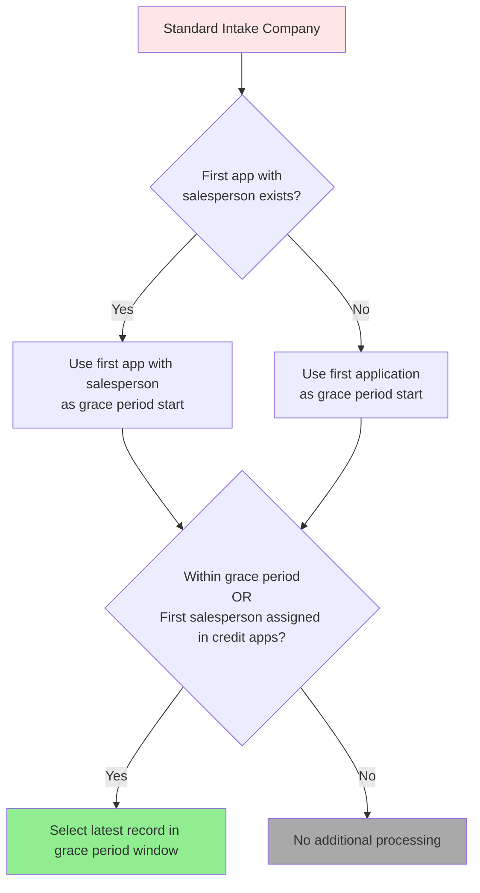
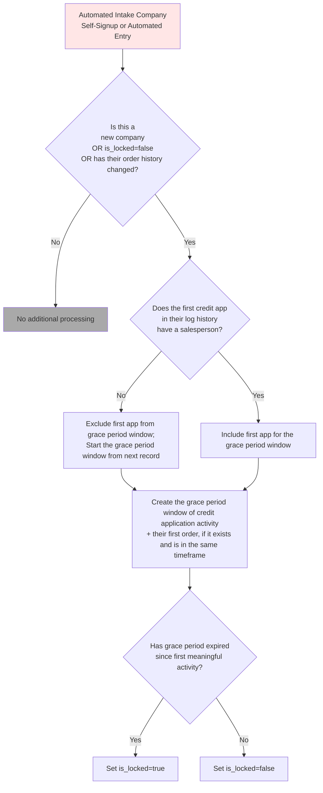
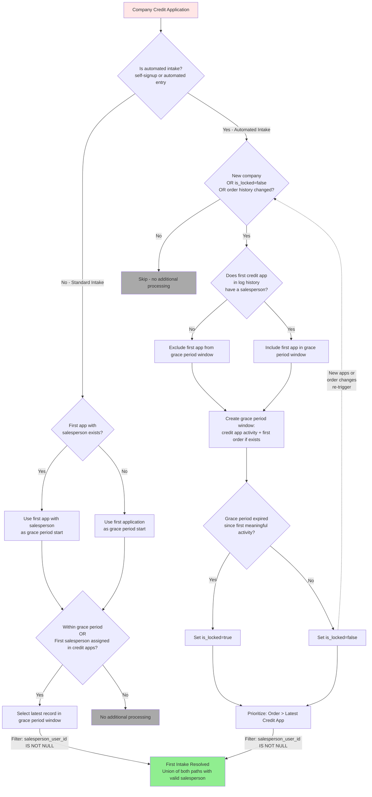
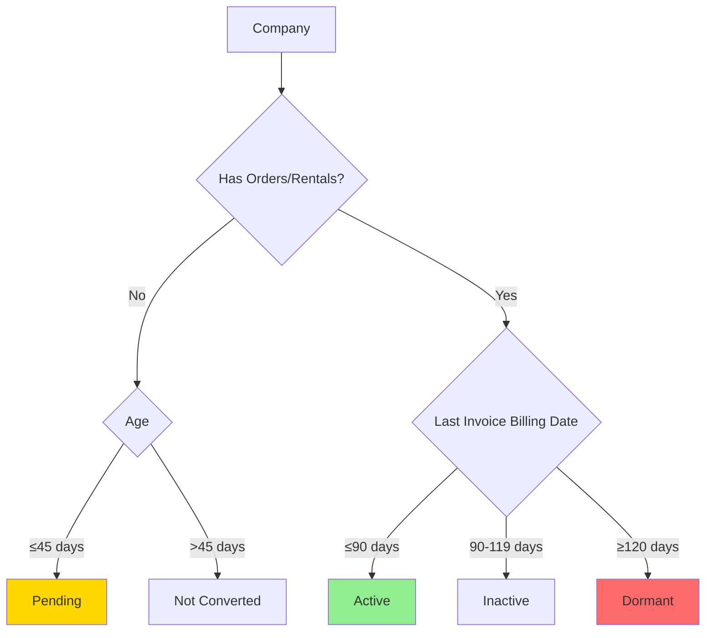


Combines all companies that were flagged manually.



Combines all companies identified with some sort of merge mapping.



Companies that were merged via 'Merge Duplicate Account' feature get their names updated to 
'duplicate-merged-to-[company_id]'. This maps the original company id to the new company_id indicated in the name.



Combines all companies that have been:
* mapped to each other by email
* manually mapped to each other
* merged through the automated process
and recursively resolves merges into a final single target company.



Maps users' companies to companies by email domain.

- Type 1: exact match where `lower(user.email) = lower(company_name)` but company IDs differ in users vs companies.
- Type 2: domain match where a domain maps to exactly one `company_id` among users; join companies sharing that domain; IDs differ.
- Outputs distinct pairs (with names) and excludes `to_company_id` in the flagged list.



There is a `salesperson` and `salesperson_user_id` field in the Credit Application form.
Before Retool, it wasn't standardized that when one field was populated, the other was also populated. Post-Retool, this seems to be guaranteed.
This model is a small cleaning step on mapping applications before Retool where `salesperson_user_id` is null and populates it with a `user_id` that's in ESDB.



Maps credit application users to the latest user-employee relationships from staging data.
This is necessary because while the data in the credit application is accurate at that point in time,
the user-employee relationship may have changed since.

Example scenario:
* On the credit app, salesperson_user_id = 28090 and salesperson_employee_id = 727, but this relationship doesn't exist in the bridge table
* This is because maybe the user got updated to remove the connection to that employee_id, and it got associated elsewhere
* The users table (at the time of this writing) tells us employee_id = 727 is tied to user_id = 13496 --> so this should be our source of truth

This model:
* References staging credit applications directly (includes all records, even deleted)
* Maps `created_by_email` to a user
* Maps the credit app salesperson to the current salesperson user_id and employee_id
* Maps the credit app credit specialist to their respective user_id and employee_id



The foundational credit application model that consolidates staging data with user mappings, filters deleted records, and adds computed business logic fields.

This model:
* Filters soft deletes (`WHERE is_deleted = false`)
* Handles hard deletes via post-hook (removes records marked as deleted after initial load)
* Brings in user/employee mappings from `int_credit_app_map_user_employee`
* Adds computed fields:
  - `app_type`: Categorizes as 'Credit' or 'COD' based on app_status
  - `is_automated_entry`: Flags automated records from Branch/System source
  - `is_batch_loaded_entry`: Flags batch-loaded entries at table initialization

This is the base model for all downstream credit application analysis.



Lookup table that filters out credit applications marked as 'Duplicate' or companies flagged as duplicates manually or by name.
Returns only `camr_id` and `company_id` - join to `int_credit_app_base` for detailed fields.



Lookup table identifying the first credit application per company based on `date_created_ct`.
Excludes credit applications requesting credit evaluation but have not set up a company in our system (no associated company_id).
Returns only `camr_id` and `company_id` - join to `int_credit_app_base` for detailed fields.



Lookup table identifying the first credit application per company that has a salesperson assigned.
Returns only `camr_id` and `company_id` - join to `int_credit_app_base` for detailed fields.



For **standard intake companies**, captures the credit application to use after a grace period.

**Grace Period Start Logic:**
- Prefers the first application WITH salesperson (from `int_credit_app_lookup_first_application_with_salesperson`)
- Falls back to the absolute first application if no salesperson ever assigned
- If a salesperson is assigned after the initial grace period closes, the model **re-evaluates** with a new grace period starting from that assignment date

**Grace Period Window:**
Credit specialists have a grace period from the determined start date to assign the correct salesperson.
The model takes the **absolute latest** credit application record within the grace period window. After the grace period expires, the credit application record selection is locked. However, if a company receives their first salesperson assignment, the model re-evaluates with a new grace period starting from that first assignment date.
This model does not guarantee there is a salesperson assignment.

Returns only `camr_id` and `company_id` - join to `int_credit_app_base` for detailed fields.




For **automated intake companies** (self-signup or automated entry records), creates an activity log of all credit applications and orders within a grace period of the first meaningful activity.
This model excludes the first credit application record of each company if it has no salesperson, but includes all other activity records.
This model does not guarantee there is a salesperson assignment.

**Logic:**
- Identifies companies where `is_initial_web_self_signup = true` OR `is_automated_entry = true`
- Excludes first record in credit application log if it has no salesperson (null or 'Pending Rep Assignment')
- Builds activity log: credit apps + first order (if exists)
- Filters to records within the grace period of first meaningful activity
- Tracks `is_locked` flag: when the grace period expires, the record would get `is_locked = true`

**Re-evaluation:** Only re-processes if:
1. New company
2. Still unlocked (`is_locked = false`) and new credit apps arrive
3. First order changes




Lookup table identifying the latest (current) credit application per company that is not hard-deleted.
Excludes credit applications requesting credit evaluation but have not set up a company in our system (no associated company_id).
Returns only `camr_id` and `company_id` - join to `int_credit_app_base` for detailed fields.



Combines standard and automated intake paths to resolve the final salesperson attribution for each company.
This model filters both paths to guarantee records with valid salesperson assignments.

**Note:** This diagram shows the complete intake resolution flow, including logic from upstream models
(`int_credit_app_lookup_grace_period` and `int_credit_app_automated_intake_activity`).

**Logic:**
- **Standard apps**: Use latest credit app within grace period window from first application (from `int_credit_app_lookup_grace_period`)
- **Automated intake apps**: Use activity log from `int_credit_app_automated_intake_activity`. Prioritize order salesperson if order exists; otherwise use latest credit app.
    - If it resolves to the order record, the expected fields are:
      - `camr_id`,`date_received_ct`, `date_completed_ct`: NULL
      - `date_created_ct`: order date (Chicago timezone)
      - `source`: `Order`
      - `app_status`: `COD` if `net_term_id=1`at the time of the order, `Approved` if `net_terms<>1`
      - `app_type`: `COD` if `net_term_id=1` at the time of the order, `Credit'` if `net_terms<>1`
      - `notes`: `First order with salesperson`
      - `salesperson_user_id`: primary salesperson user id from order
      - `first_account_date_ct`: order date in Central Time




This model pulls the first order that was not cancelled or hard-deleted for a company.



This model pulls the first rental that was not cancelled or hard-deleted for a company.



Identifies the most recent invoice for each company based on the latest billing cycle end date.



Identifies the first order per company where the order has a salesperson assigned, since orders do not always have to have a salesperson.
Uses post-hook for cleaning up orphaned records caused by assignment changes.



Identifies the first rental per company where the rental has a salesperson assigned.
Rental activity is a better indicator of salespeople (TAM) involvement.
Uses post-hook for cleaning up orphaned records caused by assignment changes.



Identifies companies that currently have open quotes.



Identifies companies that currently have pending rentals (Draft, Pending) within the last 30 days or are currently On Rent.



Identifies unconverted companies and the markets / salespersons that may be able to help drive 



Determines conversion status for companies based on whether they have placed orders or rentals.
- 'Converted': Has orders or rentals
- 'Pending': New account (≤ 45 days) with no orders/rentals  
- 'Not Converted': Older account with no orders/rentals



Classifies companies by their activity level combining conversion status and recent business activity:
- 'Not Converted': Companies that have never converted (no orders/rentals)
- 'Pending': New account (≤ 45 days) with no orders/rentals or companies with pending business activity (via open quotes or rentals)
- 'Active': Companies with recent invoice activity (last invoice is within 90 days)
- 'Inactive': Companies with no recent business activity (90-119 days since last invoice)
- 'Dormant': Companies with no business activity for an extended period (≥120 days since last invoice)

**Status:** Active (≤90 days), Inactive (90-119), Dormant (≥120), Pending (new or has open quotes/rentals), Not Converted (never ordered).




Classifies each company by their lifetime rental history:
- 'Has Rented': Has at least one completed/returned rental (status_id in 5, 6, 7, 9) — terminal status, never downgraded
- 'Has Reservation': Has at least one active reservation (status_id in 1, 2, 3, 4) but no completed rentals
- 'Never Rented': No active non-cancelled rentals

The post-hook cleans up stale rows for companies with a recently-changed rental that now have zero active (non-cancelled, non-deleted) rentals (i.e. companies that would no longer appear in a full refresh).



This model consolidates the mimic links at the user level into one mimic link per company.
Filtering out deleted users, the priority of user tied to the link:
1. Support users with company owner access (security_level_id = 2)
2. Support users without company owner access
3. Non-support users with company owner access (security_level_id = 2)
4. Random selection of any user with a mimic link
5. Users with no links at the bottom

