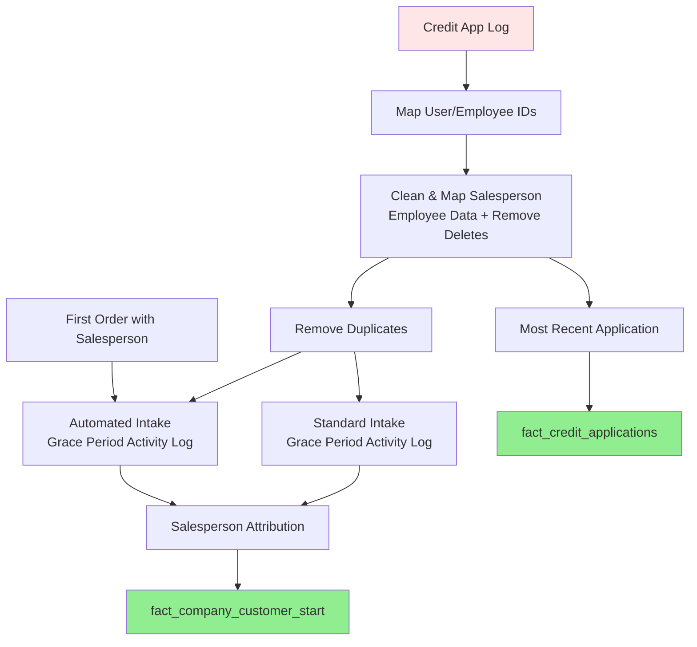

## Company Credit Application Pipeline Overview

**Tag:** `credit_application`

### Pipeline Flow

**1. Map User/Employee IDs** (`int_credit_app_map_user_employee` + `int_credit_app_map_missing_salesperson_user_id`)
- References staging data directly (includes all records, even deleted)
- Maps missing salesperson user IDs from legacy data
- Links credit app users to current employee records
- Resolves user-employee relationships that may have changed over time

**2. Clean & Map Salesperson Employee Data** (`int_credit_app_base`)
- Filters out soft-deleted records (`WHERE is_deleted = false`)
- Combines staging data with user/employee mappings
- Adds computed business logic fields:
  - `app_type`: Credit vs COD categorization
  - `is_automated_entry`: Flags automated records
  - `is_batch_loaded_entry`: Flags batch-loaded entries

**3. Remove Duplicates** (`int_credit_app_lookup_valid_applications`)
- Filters out applications marked as 'Duplicate'
- Excludes companies flagged as duplicates manually or by name
- Thin lookup table (camr_id, company_id only)

**4. Grace Period Activity Windows**
- **Automated intake** (`int_credit_app_automated_intake_activity`):
  - For self-signup and automated entry records
  - Combines credit apps + first order within grace period of first meaningful activity
  - Excludes first app if no salesperson assigned
  - Tracks `is_locked` flag once grace period window closes
  - Re-evaluates if new company or is_locked=false with new credit app entries or if first order with salesperson changes
- **Standard intake** (`int_credit_app_lookup_grace_period`):
  - Uses latest credit app within grace period window from first application
  - Grace period allows time for salesperson assignment
  - Re-evaluates if company receives first salesperson assignment

**5. Salesperson Attribution** (`int_credit_app_first_intake_resolved`)
- Combines both automated intake and standard intake paths
- For automated intake: prioritizes order record if order exist, else latest credit app
- For standard intake: uses latest app from grace period window
- Filters both paths to ensure valid salesperson assignment (salesperson_user_id IS NOT NULL)
- Single source of truth for first salesperson attribution per company

**6. Fact Tables**
- `fact_credit_applications`: All credit applications with dimension keys
- `fact_company_customer_start`: First customer touchpoint with resolved salesperson