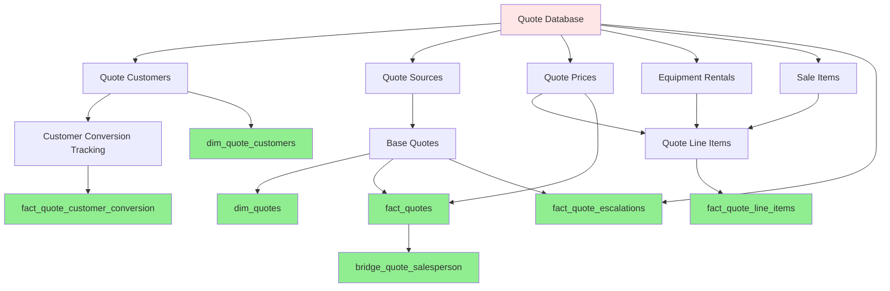

## Quotes Data Pipeline Overview

**Tag:** `quotes`

### Pipeline Flow

**1. Quote Sources** (`int_quote_sources`)
- Identifies quote origin channel (Retail vs Online/Internal Quotes Tool)
- Legacy quotes from rental_order_requests created before 2024-12-07 classified as "Retail"
- Flags guest requests from non-logged-in users
- Provides channel attribution for downstream analysis

**2. Base Quotes with Status Logic** (`int_quotes`)
- Central quote hub applying business status logic with precedence:
  1. **Order Created** → converted to rental (order_id exists)
  2. **Missed Quote** → lost opportunity (reason provided)
  3. **Expired** → passed expiration date
  4. **Escalated** → requires manager approval
  5. **Open** → active quote awaiting decision
- Calculates rental duration (num_days_quoted)
- Splits datetime fields for dimensional modeling
- Enriched with quote source and guest request flag

**3. Quote Customers & Conversion Tracking**
- **Quote Customers** (`int_quote_customers`):
  - Links quote customers/prospects to company master data
  - Distinguishes new prospects from existing customers
  - Preserves archived status for inactive prospects
- **Customer Conversion** (`int_quote_customer_conversion`):
  - Uses point-in-time history to identify prospect→customer conversion
  - Matches quote customer creation with company account creation
  - Tracks which quote led to customer conversion

**4. Line Items & Pricing**
- **Equipment Rentals** (`int_quote_equipment_rentals`):
  - Enriches rental line items with rate types (Daily, Weekly, Monthly)
  - Applies shift multipliers (1x Single, 1.5x Double, 2x Triple)
  - Separates equipment rentals from accessories/bulk items
- **Sale Items** (`int_quote_sale_items`):
  - Isolates add-on products and services
- **Consolidated Line Items** (`int_quote_line_items`):
  - Unified view of all line types (rentals, accessories, sale items)
  - Standardized schema for cross-category analysis
- **Quote Prices** (`int_quote_prices`):
  - Aggregates pricing components (rental subtotal, sale items, equipment charges, fees, tax, RPP, total)

**5. Dimensions**
- **`dim_quotes`**: Quote attributes with helper flags (has_equipment_rentals, has_accessories, has_sale_items) and business context (project_type, delivery_type, po_id, is_tax_exempt, is_guest_request)
- **`dim_quote_customers`**: Customer/prospect attributes linked to company master

**6. Facts**
- **`fact_quotes`**: Quote-level metrics with all pricing measures and dimensional keys
- **`fact_quote_line_items`**: Granular line item analysis with rates and quantities
- **`fact_quote_escalations`**: Escalation events with time-to-escalation metrics
- **`fact_quote_customer_conversion`**: Prospect conversion tracking

**7. Bridge**
- **`bridge_quote_salesperson`**: Many-to-many mapping supporting primary and secondary sales reps, re-evaluated on salesperson reassignments