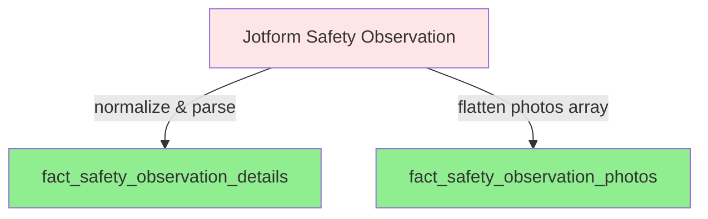

## Safety Observation Pipeline Overview

**Tag:** `safety_observation`

### Pipeline Flow

**1. Normalize & Parse Fields** (`stg_jotform__safety_observation`)
- Renames and casts all raw columns to standardized types
- Parses `observation_time` from a freeform string into a normalized 12-hour format (`observation_time_12h`)
- Constructs `observation_datetime` by combining `observation_date` + `observation_time_12h`
- Computes `observation_datetime_final` as the earliest of `observation_datetime` and `created_at`
- Parses `photos` from a JSON string into an ARRAY
- Normalizes `observation_category` with a `COALESCE` fallback to `'Unspecified'`

**2. Observation Details** (`fact_safety_observation_details`)
- Joins to `dim_markets` on market name when it's a currently active market and is a market owned by us (`market_company_id = 1854`)
- Deduplicates employees on `work_email`, prioritizing active status then most recent hire date
- Uses `snowflake.cortex.summarize()` to generate an AI summary of `observation_description`
- Computes `has_uploaded_photos` flag

**3. Observation Photos** (`fact_safety_observation_photos`)
- Flattens the `photos` array from staging into one row per photo
- Foreign key relationship to `fact_safety_observation_details` via `safety_observation_key`
